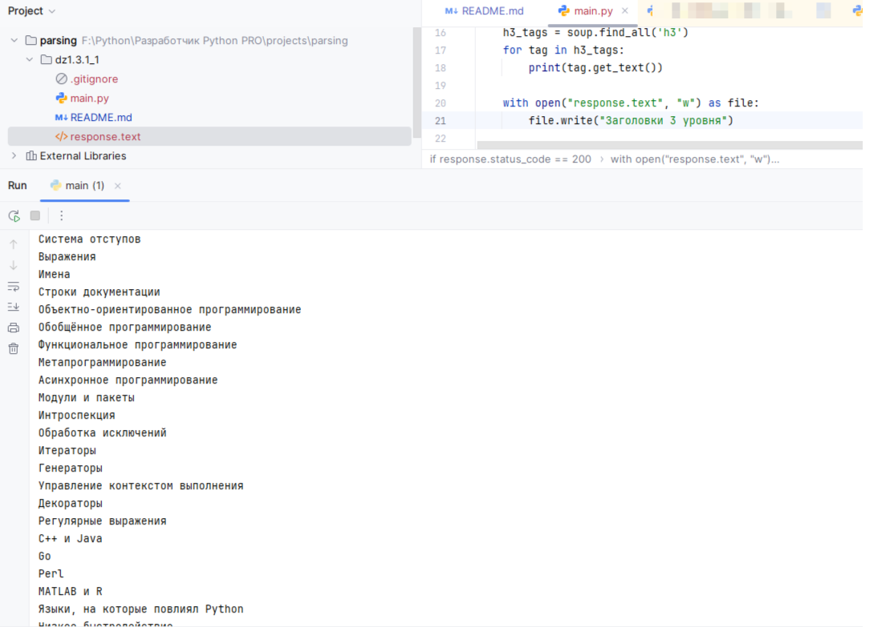

# dz1.3.1_1
## Домашнее задание к уроку 1.3.1_1 Парсинг данных
Реализовать парсер, который собирает все заголовки 3 уровня(h3), со страницы https://ru.wikipedia.org/wiki/Python и сохраняет их в текстовый файл

## Результат:
"Запрос выполнен успешно!
Операторы
Система отступов
Выражения
Имена
Строки документации
Объектно-ориентированное программирование
Обобщённое программирование
Функциональное программирование
Метапрограммирование
Асинхронное программирование
Модули и пакеты
Интроспекция
Обработка исключений
Итераторы
Генераторы
Управление контекстом выполнения
Декораторы
Регулярные выражения
C++ и Java
Go
Perl
MATLAB и R
Языки, на которые повлиял Python
Низкое быстродействие
Глобальная блокировка интерпретатора (GIL)
Синтаксис и семантика
Невозможность модификации встроенных классов
CPython
PyPy
Jython
Другие реализации
Интерактивный режим
IDE
Комментарии
Источники
Персональные инструменты
Пространства имён
Просмотры
Поиск
Навигация
Участие
Инструменты
Печать/экспорт
В других проектах
На других языках
Содержимое страницы: <!DOCTYPE html>
<html class="client-nojs" lang="ru" dir="ltr">
<head>
<meta charset="UTF-8">
<title>Python — Википедия</title>
<script>(function(){var className="client-js";var cookie=document.cookie.
Process finished with exit code 0"

